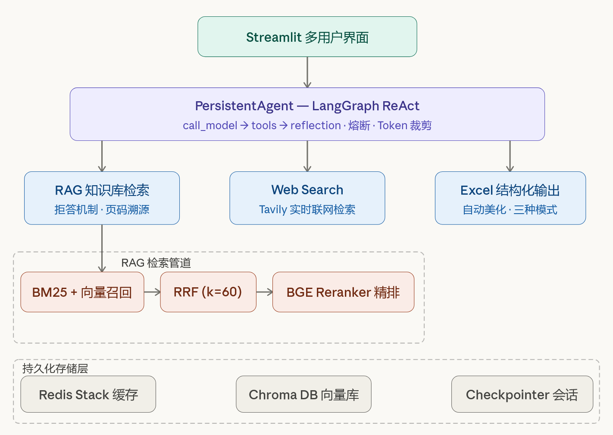
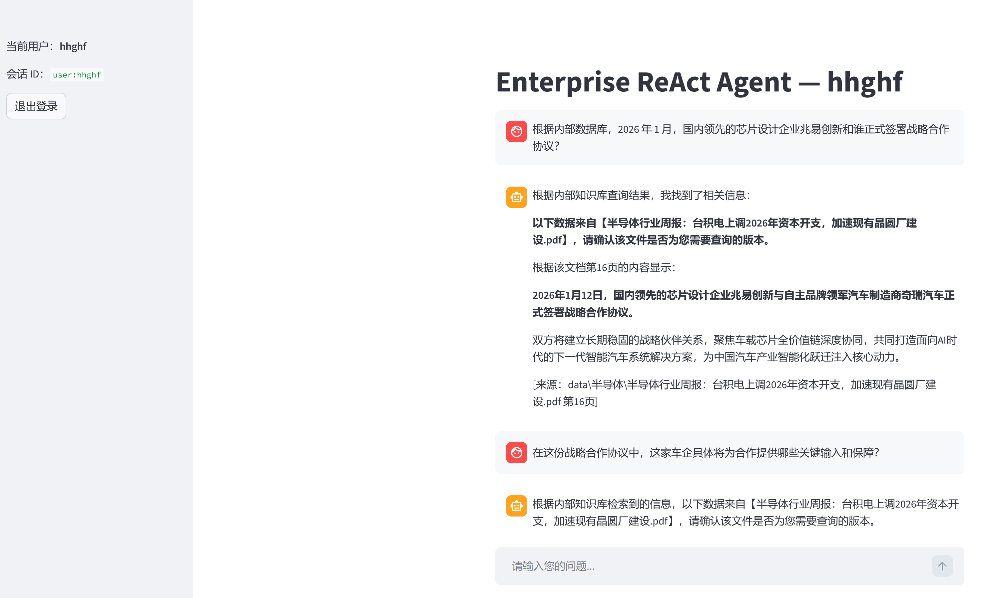
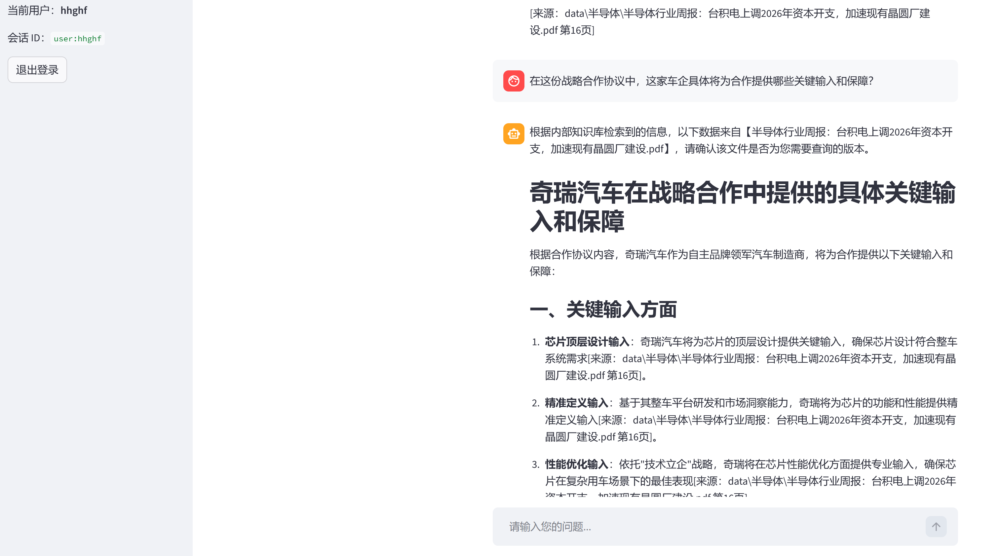
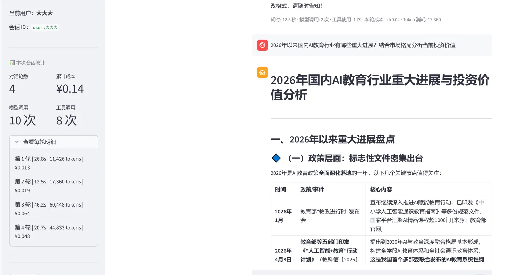
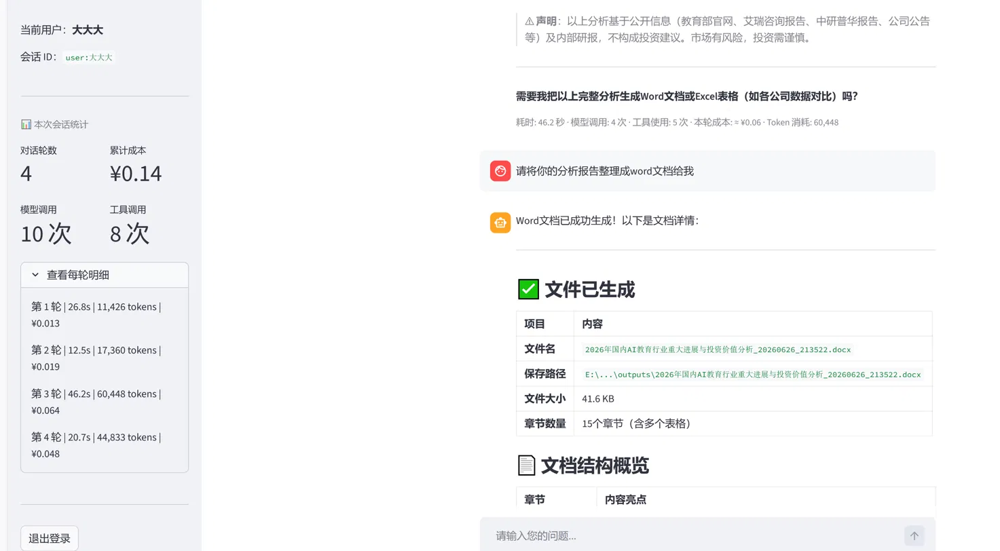
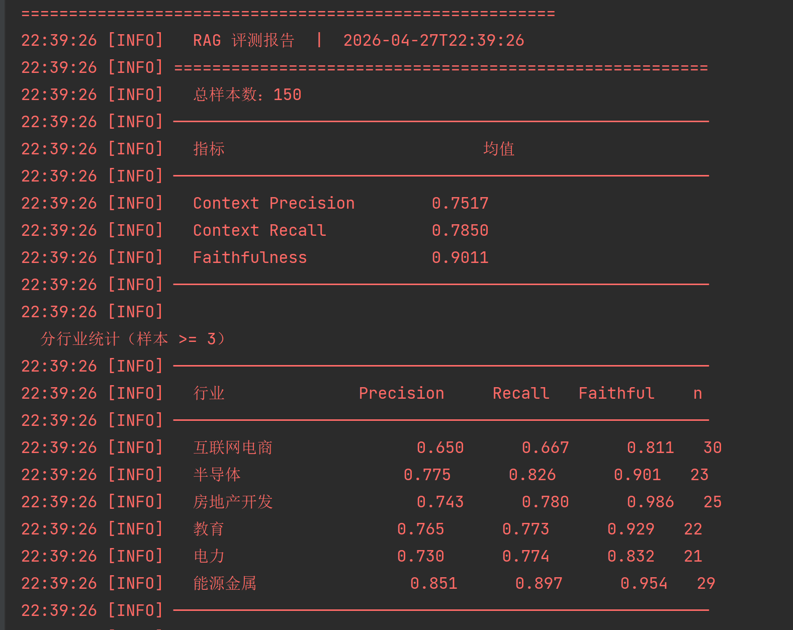

# ReAct-RAG-Agent — 面向金融研报问答与知识密集型场景的企业级智能体框架

## 这个项目解决了什么问题

金融分析师每天面对数百份研报、年报和政策文件，想知道"比亚迪 Q3 毛利率是多少"或"新能源行业最新政策对哪些公司影响最大"，传统做法是逐篇打开 PDF 手动查找，费时且容易遗漏。

这个 Agent 能在数秒内完成跨文档检索、提取关键财务指标、生成对比分析，并**标注来源文档和页码**，确保每条结论可追溯——通过持久化记忆在下次对话直接延续上次的分析进度，不需要重新描述背景。

**实际使用场景（已验证）：**
- 从数百份研报 PDF 中快速定位涉及特定公司、指标或行业的段落，标注来源页码
- **精确查询结构化财务数据**：通过 `sql_tool` 以自然语言查询 SQLite 财务指标库，返回带来源文件名和页码的精确数值（如"Shopee 2025 年收入"、"对比所有公司 FY24 毛利率"）
- 联网检索行业信息，自动整理为结构化 Excel 表格
- **联网搜索 + Word 报告一键生成**：搜索"中国银行 23.67 亿元违规避税事件"并深度分析后，一句"整理成 word 文档"即生成带章节结构和来源标注的 `.docx`（实测 39.4 KB / 7 章节 / 20.7s / ≈ ¥0.05）
- **同一会话内多格式联动输出**：分析"2026 年国内 AI 教育行业重大进展与投资价值"后，先生成 Word 研究报告（41.6 KB / 15 章节含多表格），追加一句再生成各公司数据对比 Excel（13 家公司）；全程 4 轮、¥0.14、10 次模型调用、8 次工具调用
- 多用户同时使用，各自维护独立的对话历史与分析上下文
- 通过 REST API / SSE 接入外部系统（n8n、自定义前端、第三方服务）

---

## Architecture



- 绿色 → 用户入口（Streamlit UI + FastAPI 服务层）
- 紫色 → Agent 核心（LangGraph ReAct 循环）
- 蓝色 → 三个工具层
- 橙色 → RAG 内部流水线（双路召回 → RRF 融合 → 精排）
- 灰色 → 持久化存储

| 维度 | 说明 |
|------|------|
| **核心价值** | 用自然语言驱动私有研报知识库检索、联网搜索与结构化输出，每条结论标注来源文档与页码，可追溯、可验证；精确财务指标走 Text2SQL 路径，尽量规避纯文本 RAG 的时间错位幻觉 |
| **架构** | LangGraph `StateGraph` + ReAct 范式（推理 → 工具调用 → 观察 → 反思） |
| **服务层** | Streamlit（交互 UI）+ FastAPI（REST + SSE 流式），双入口并存，共享同一 Agent 实例与持久化存储 |
| **记忆机制** | Checkpoint 持久化，支持 Memory / SQLite / PostgreSQL / Redis 四后端自动降级（当前默认 PostgreSQL），多用户会话隔离与跨会话历史恢复 |
| **缓存层** | Redis Stack 双级缓存：BM25 索引持久化 + 置信度门控语义缓存 |
| **语言优先** | 中文系统提示 / `zh-CN` / `Asia/Shanghai` 全链路中文优化 |
| **容错设计** | 反思节点 + 工具熔断 + 指数退避重试 + 递归步数保护 + **工具调用协议健壮性兜底**（悬空 tool_call / invalid_tool_calls 防御，见踩坑节） |
| **成本控制** | Token 统计、历史消息裁剪、工具调用轨迹可视化 |
| **评测体系** | RAGAS 自动评测管道，检索 / 端到端双模式，实测 Precision 0.7517 / Recall 0.7850 / Faithfulness 0.9011（150 样本，6 行业） |

---

## Screenshots

### 多轮对话与来源溯源
> 用户连续追问，Agent 基于上轮检索结果直接深入分析，每条结论标注来源文档与页码




### 文档生成全链路（联网搜索 → 分析 → Word / Excel 输出）
> 同一会话内完成：联网搜索事件 → 深度分析 → 生成 Word 报告 → 生成 Excel 对比表，全程 4 轮、¥0.14




### RAGAS 自动评测报告
> 150 条样本、6 个行业分组实测，Context Precision 0.7517 / Recall 0.7850 / Faithfulness 0.9011



---

## 模块划分

系统由六大模块组成，职责清晰、低耦合高内聚。

### Core — 图与状态
- `graph.py`：主工作流图。运行时路径为 `call_model →(route_model_output)→ tools / postprocess_tools → reflection → call_model`，无待办工具调用时经路由收敛到 `__end__`
- `nodes.py`：各节点逻辑（模型调用、工具执行、反思、Guard 哨兵、跨轮隔离、**悬空 tool_call 入口净化与异常兜底**）
- `routing.py`：动态路由决策，依据"消息是否含待应答 tool_call"决定流向（检测口径覆盖 `.tool_calls` 与 `.invalid_tool_calls`）
- `state.py`：扩展 `InputState`，统一管理工具轨迹、工作记忆、引用清单、错误计数、Token 统计等运行时状态
- `prompts.py`：结构化中文系统提示，覆盖工具决策、查询改写、搜索结果处理、输出风格、跨轮独立性规则
- `agent.py`：`PersistentAgent` 包装器，对外暴露 `invoke` / `stream`，内置历史裁剪与跨轮消息隔离
- `checkpointer.py`：Checkpointer 工厂，支持 Memory / SQLite / PostgreSQL / Redis 四后端，自动降级
- `config.py`：运行时配置加载（含 `RedisConfig`）

### API — 服务层（FastAPI）

与 Streamlit UI 并存的 REST 服务，将 Agent 能力暴露为标准 HTTP 接口。

- `api/main.py`：应用入口，lifespan 启动预热（提前编译 LangGraph，消除首请求冷启动）、CORS、全局异常兜底
- `api/dependencies.py`：`PersistentAgent` 模块级单例，`get_agent()` 作 Depends 注入，全进程只初始化一次，与 Streamlit 侧共用同一套 checkpointer
- `api/models.py`：Pydantic 请求/响应模型，`resolve_thread_id()` 统一处理 `session_id → user:{session_id}` 映射
- `api/routes/chat.py`：两个核心端点

| 端点 | 说明 |
|------|------|
| `GET /health` | 健康检查，返回 Agent 初始化状态与 checkpoint 后端 |
| `POST /chat/stream` | SSE 流式对话，推送 `tool_call` / `tool_result` / `token` / `done` / `error` 五类事件 |
| `POST /chat/invoke` | 非流式对话，一次性返回，适合不支持 SSE 的调用方（n8n、Zapier 等） |

**session 管理：** 不传 `session_id` 时自动生成 UUID，首次通过 `X-Session-Id` 响应头与 `done` 事件返回；传入则续接，历史由 checkpointer 持久化，进程重启不丢；命名空间与 Streamlit 侧（`user:{username}`）隔离。

> **注意**：当前 `/chat/stream` 推送粒度为 LangGraph **节点级**，非逐 token。如需 token 级打字机效果，可在 `PersistentAgent` 新增基于 `astream_events(version="v2")` 的 `stream_events()`，路由层改动极小。

### RAG — 私有知识库
- `pdf_parser.py`：**金融研报级 PDF 版面解析**。PyMuPDF 提取带 bbox 坐标文字块（多栏检测 + 阅读顺序重建 + 页眉页脚过滤），pdfplumber 提取结构化表格转 Markdown 整块保留；表格与正文分离，避免被字符分块器破坏；模块级 + 文件级双重降级，链路不断裂
- `loaders.py`：PDF / DOCX / TXT / MD / CSV / Excel 多格式加载；PDF 分支已从 PyPDFLoader 替换为 `load_pdf_with_layout`
- `chunker.py`：语法感知分块（chunk_size=500）；PDF 走预分块透传路径，跳过二次 split，防止表格 Markdown 被截断
- `retriever.py`：**BM25 + 向量双路检索**，RRF 融合（k=60），各路 Top-10 合并去重返回最多 20 候选；BM25 索引优先从 Redis 加载，HMAC-SHA256 签名校验防 pickle 注入
- `reranker.py`：Cross-Encoder 精排（`BAAI/bge-reranker-v2-m3`）；**返回 `(docs, top_score)` 元组**，最高分透传给缓存层做置信度门控；阈值过滤（默认 0.1，sigmoid 空间）后返回 Top-3；模型异常降级返回 RRF 结果（`top_score=0.0`）；`RERANKER_DEBUG=1` 打印逐条得分
- `vector_store.py`：Chroma 持久化，文件哈希增量更新；**T1+T2 解析多进程并行**（`Pool.imap_unordered`，4 worker，218 份研报全量建库 ~57 min → ~28 min，效率 ×3.37）；**T4 写入用 `upsert` 替代 `add`**（幂等，防崩溃重跑 `DuplicateIDError`）；哈希每批写完立即落盘，崩溃重启无脏数据；知识库更新后自动失效 Redis 缓存；每次建库写入 `ingestion_metrics.jsonl`
- `semantic_cache.py`：**Redis 语义缓存（置信度门控）**，写入前校验 Reranker top_score：高置信（≥0.5）长 TTL，空结果短 TTL（300s）允许重试，低置信跳过缓存避免错误固化

### Tools — 工具链
- `search.py`：Tavily Web 搜索，返回 title / url / content / score / published_date
- `rag.py`：调用 RAG 检索管道；结果含来源文件路径与页码（`[来源：xxx.pdf 第 N 页]`）；内置拒答（无相关内容返回 `has_relevant_content: false`）；命中语义缓存时标 `meta.stage=semantic_cache_hit`
- `sql.py`：**结构化财务数据精确查询**（Text2SQL）。自然语言经 LLM 转 SQL 后查 SQLite `financial_metrics` 表，结果强制携带 `source_file` / `source_page`，`is_estimate=1` 自动加"（预测值）"标签；SELECT 白名单安全拦截
- `excel.py`：Excel 表格生成（timestamp / overwrite / append 三模式），自动美化表头、冻结首行
- `make_docx.py`：**Word 文档生成**（python-docx）。正式研报排版（深蓝标题 #1F497D、A4 边距、等线 11pt、表头深蓝底白字 + 交替浅灰行、页脚工具标注）；三阶段处理（校验 → 构建 → 写出）；延迟 import，缺依赖经 `_err` 返回结构化错误不崩溃
- `markdown.py`：**Markdown 文档生成**，纯标准库无依赖；多级标题、GFM 表格、无序列表、frontmatter 元数据块；适用 Notion / 飞书 / GitHub 渲染场景

**当前注册工具列表（`tools/__init__.py`）：**

```python
TOOLS = [search, make_excel_table, query_internal_knowledge, docx_tool, md_tool]
```

> ⚠️ `sql.py` 仍在 `tools/` 目录下，但当前未注册进 `TOOLS`。如需启用 Text2SQL，将 `sql_tool` 加回 `TOOLS` 并更新系统提示工具优先级即可。

**输出格式选择规则（须在 `prompts.py` 中明确）：**

| 场景 | 工具 |
|------|---------|
| 数字对比、多公司财务数据、需筛选排序 | `make_excel_table` |
| 分析摘要、上传 Notion / 飞书 / GitHub | `md_tool` |
| 正式对外交付、需打印或邮件附件 | `docx_tool` |
| 仅需口头回答 | 不调用输出工具 |

### Memory / Utils
- `memory/context.py`：`Context` 数据类，集中管理运行时参数，支持环境变量覆盖
- `utils/llm.py`：LLM 加载与 provider 解析（openai / anthropic / local / deepseek）
- `utils/redis_client.py`：Redis 连接池单例（异步 + 同步双客户端），全项目共用
- `utils/timer_logger.py`：建库流水线计时器，`timer()` 按阶段埋点，`summarize_last_run()` 写 `ingestion_metrics.jsonl`
- `utils/token_utils.py`：Token 计数与费用估算（兼容 OpenAI / Anthropic 缓存 token 格式）
- `utils/tool_utils.py`：工具层通用辅助，含 **`_ai_tool_call_ids()` 全项目统一的待应答 tool_call 检测口径**（覆盖 `.tool_calls` / `.invalid_tool_calls`）
- `utils/tool_helpers.py`：`_ok` / `_err` / `with_retry` 公共返回结构与重试装饰器

---

## Tech Stack

| 层次 | 技术 |
|------|------|
| **Agent 框架** | LangGraph ≥ 1.0、LangChain ≥ 0.2 |
| **大模型接入** | DeepSeek / Anthropic Claude / OpenAI（`provider/model` 统一格式） |
| **Web 搜索** | langchain-tavily |
| **向量数据库** | Chroma（langchain-chroma） |
| **缓存层** | Redis Stack（BM25 索引持久化 + 置信度门控语义缓存，HMAC 签名校验） |
| **PDF 解析** | PyMuPDF（版面感知）+ pdfplumber（结构化表格） |
| **嵌入 / 精排** | BAAI/bge-small-zh-v1.5 / BAAI/bge-reranker-v2-m3 |
| **结构化输出** | openpyxl / pandas / python-docx |
| **持久化** | SQLite / PostgreSQL（psycopg-pool）/ Redis / SQLite 财务指标库 |
| **UI / API** | Streamlit（多用户登录）/ FastAPI + Uvicorn（SSE + REST） |
| **运行时** | Python ≥ 3.10，uv 包管理 |

---

## 启动方式

```bash
# Streamlit UI
cd src && streamlit run tests\test_agent.py

# FastAPI 服务
cd src && uvicorn api.main:app --host 0.0.0.0 --port 8000 --reload
```

两个服务可同时运行，共享同一 Agent 实例与持久化存储，会话历史互通。

---

## Directory Structure

```
react-agent-main/
├── src/
│   ├── api/                              # FastAPI 服务层（Phase 0-5 生产化重构）
│   │   ├── main.py                       # app 入口：lifespan 预热、fail-fast 配置校验、挂载 v1 + legacy 路由
│   │   ├── settings.py                   # pydantic-settings 配置校验（provider-aware LLM key 检查，零副作用）
│   │   ├── errors.py                     # RFC 7807 problem+json 统一错误信封 + 全局 exception handler
│   │   ├── middleware.py                 # ASGI 中间件：request_id 贯穿全链路 + JSON 结构化日志 + Prometheus 采集
│   │   ├── security.py                   # API Key 鉴权（X-API-Key / Bearer 两种格式，含 client:IP 匿名降级）
│   │   ├── ratelimit.py                  # Redis 固定窗口限流（RPM）+ per-user 当日 token 预算（fail-open）
│   │   ├── metrics.py                    # Prometheus 指标：ttft / 输出 token / 成本 / inflight（与计费同源）
│   │   ├── dependencies.py               # PersistentAgent 单例（全进程初始化一次，Depends 注入）
│   │   ├── models.py                     # Pydantic 请求/响应模型（含 SessionHistoryResponse 分页结构）
│   │   └── routes/
│   │       ├── chat.py                   # [legacy] 节点级 SSE，向后兼容保留（Deprecation: true 响应头）
│   │       └── v1/
│   │           ├── chat.py               # token 级 SSE 流式 + 断连即取消 upstream Task
│   │           └── sessions.py           # 会话 CRUD：bucket_key 命名空间隔离（防 IDOR，404 不泄露存在性）
│   ├── tests/
│   │   ├── test_agent.py                 # Streamlit UI 测试入口
│   │   └── api/                          # FastAPI 回归测试套件（44 条，零真实 LLM / Redis 调用）
│   │       ├── conftest.py               # FakeAgent + fakeredis + asgi-lifespan 共享 fixtures
│   │       ├── test_auth.py              # 鉴权场景（无 key / 错 key / Bearer / 免鉴权端点）
│   │       ├── test_errors.py            # RFC 7807 信封结构 + request_id 透传
│   │       ├── test_metrics.py           # Prometheus 计数器 / 直方图 / inflight 指标
│   │       ├── test_ratelimit.py         # RPM 超限 / 日 token 预算 / 匿名 IP 桶 / Redis 宕机 fail-open
│   │       └── test_sessions.py          # 会话 CRUD + IDOR 防护 + 分页边界（11 条）
│   ├── react_agent/
│   │   ├── core/
│   │   │   ├── agent.py                  # PersistentAgent：invoke / stream_events / get_history / delete_thread
│   │   │   ├── checkpointer.py           # Checkpointer 工厂（SQLite / PostgreSQL / Redis / Memory，自动降级）
│   │   │   ├── config.py                 # 运行时配置（含 RedisConfig）
│   │   │   ├── graph.py                  # 主工作流图（call_model → tools → reflection 循环）
│   │   │   ├── nodes.py                  # 节点逻辑（Guard 哨兵 / 跨轮隔离 / 悬空 tool_call 净化）
│   │   │   ├── routing.py                # 动态路由（检测 .tool_calls + .invalid_tool_calls）
│   │   │   ├── prompts.py                # 结构化中文系统提示（工具决策规则 / query 改写规则）
│   │   │   └── state.py                  # 统一运行时状态（工具轨迹 / 引用清单 / 错误计数 / Token 统计）
│   │   ├── memory/context.py             # Agent 运行时可配置参数
│   │   ├── tools/
│   │   │   ├── _doc_common.py            # 文档工具共享：normalize / metadata 容错 / 文件名生成
│   │   │   ├── search.py                 # Tavily Web 搜索
│   │   │   ├── sql.py                    # Text2SQL 财务精查（SELECT 白名单 + source_file/page 溯源）
│   │   │   ├── rag.py                    # RAG 检索（页码引用 + 语义缓存标记）
│   │   │   ├── excel.py                  # Excel 表格生成（timestamp / overwrite / append 三模式）
│   │   │   ├── make_docx.py              # Word 文档生成（python-docx，正式研报排版）
│   │   │   └── markdown.py               # Markdown 文档生成（GFM + frontmatter）
│   │   ├── rag/
│   │   │   ├── pdf_parser.py             # 研报级 PDF 版面解析（PyMuPDF + pdfplumber，双栏检测 + 双重降级）
│   │   │   ├── loaders.py                # 多格式加载（PDF 分支已替换为 pdf_parser）
│   │   │   ├── chunker.py                # 语法感知分块（PDF 预分块透传）
│   │   │   ├── retriever.py              # BM25 + 向量双路检索（各 Top-10）+ RRF 融合（k=60）
│   │   │   ├── reranker.py               # Cross-Encoder 精排（返回 docs + top_score）
│   │   │   ├── semantic_cache.py         # Redis 语义缓存（top_score 门控 + 差异化 TTL）
│   │   │   └── vector_store.py           # Chroma 持久化 + 文件哈希增量更新 + 多进程建库
│   │   └── utils/
│   │       ├── llm.py                    # LLM 加载与 provider 解析
│   │       ├── redis_client.py           # Redis 异步连接池单例
│   │       ├── timer_logger.py           # 建库计时器（jsonl 埋点）
│   │       ├── token_utils.py            # Token 计数与费用估算
│   │       ├── time_utils.py             # 时间工具
│   │       ├── tool_utils.py             # 工具层通用辅助（含 _ai_tool_call_ids 统一检测口径）
│   │       └── tool_helpers.py           # _ok / _err / with_retry
│   ├── eval/
│   │   ├── run_eval.py                   # RAGAS 自动评测（检索 + 端到端双模式）
│   │   └── dataset_generator.py          # QA 对生成（含 Missing Entity 防护）
│   ├── scripts/
│   │   ├── extract_financials.py         # 离线财务指标抽取（断点续跑 + 幂等入库）
│   │   ├── check_pdfs.py                 # PDF 质检（加密 / 扫描版 / 乱码 / 重复）
│   │   ├── manage_memory.py              # 会话历史管理（导出 / 统计 / 清理）
│   │   └── verify_redis.py               # Redis 健康检查与缓存诊断
│   ├── data/                             # 私有知识库文档目录（PDF 研报）
│   ├── chroma_db/                        # 向量库持久化目录
│   ├── config.yaml                       # 运行时配置入口（LLM / RAG / 持久化后端）
│   ├── mcp_rag_server.py                 # RAG 工具的 MCP Server 改造
│   └── pyproject.toml / requirements.txt / .env.example / .gitignore
```

---

## 关键工程设计（面试可展开）

### 1. 双引擎 PDF 解析
金融研报普遍存在双栏排版、表格密集、页眉页脚干扰。PyMuPDF 提取带 bbox 文字块、检测双栏分界、按列排序后合并恢复阅读顺序；pdfplumber 提取表格转 Markdown 整块保留，避免被字符分块器在 `|` 处截断。模块级 + 文件级双重降级，`ingestion_metrics.jsonl` 记录降级原因。

### 2. 三级检索精排管道
```
BM25（Top-10）─┐
               ├→ RRF 融合（k=60）→ 20 候选 → Cross-Encoder 精排 → Top-3
向量（Top-10）─┘
```
BM25 擅长精确关键词（股票代码、财务指标），向量擅长语义近似，RRF 消除各路排名偏差；Reranker 返回 `(docs, top_score)`，最高分透传给语义缓存做门控。

### 3. 置信度门控语义缓存
普通语义缓存对"有结果"和"高质量结果"不加区分，早期低相关结果被长期缓存会持续污染后续查询。门控策略：

| Reranker top_score | 缓存行为 |
|---|---|
| ≥ 0.5 | 正常缓存，TTL 3600s |
| 0.0 ~ 0.5 | **跳过缓存**，避免低质固化 |
| 空结果 | 缓存，TTL 300s，允许重试 |

### 4. 多用户会话隔离
`default_thread_id = None`，未传时抛 `ValueError`，禁止回落共享 `default` thread；Streamlit 侧 `user:{username}`、FastAPI 侧 `user:{session_id}`；checkpoint 按 thread_id 物理隔离。

### 5. FastAPI 与 Streamlit 并存
两入口共用模块级 `PersistentAgent` 单例 + `lifespan` 预热（首请求无 ~10s 冷启动）；SSE 节点级推送区分 `tool_call` / `tool_result` / `token`；两服务读同一份 `.env`，避免配置漂移。

### 6. Guard 哨兵与跨轮计数隔离
多轮场景下，上一轮失败的工具历史会通过 LLM 上下文推理污染下一轮决策（读到"已检索 3 次未找到"后主动放弃调用工具）。对策：Guard 消息用程序性措辞（"本轮检索上限已达"）而非事实性结论（"知识库没有答案"）；`_count_rag_in_current_turn()` 以最后一条真实 HumanMessage 为界，只统计当轮 RAG 调用，消除长对话历史累积计数。

### 7. 工具调用协议健壮性（悬空 tool_call 防御）
LLM 与外部工具交互中，模型无法稳定产出合法输出是**固有失败模式**。本项目把"消息序列协议合法"作为入口强制不变量：全项目用统一的 `_ai_tool_call_ids()` 检测待应答 tool_call（口径与 DeepSeek 实际收到的序列化路径一致，覆盖 `.invalid_tool_calls`），路由、入口净化、异常兜底三层防御，确保任何 tool_call 都不会"悬空"导致多轮 400。详见踩坑节。

### 8. RAGAS 自动评测管道
覆盖数据准备 → 检索 → 打分 → 报告全链路：关键词过滤噪声 + 固定 seed 可复现；`asyncio.Semaphore` + `gather` 并发，复用线上 `_dual_retrieve` / `_rerank`，评测与线上行为一致；`--retrieval_only` 省略 LLM 省钱 ~60%；按 industry 分组（样本 <3 自动跳过）；双格式报告（JSON 摘要 + CSV 明细）+ 控制台自动诊断建议。

### 9. Checkpointer 工厂（四级自动降级）
PostgreSQL → SQLite → Redis → MemorySaver，任一级失败自动降级，不同缓存 key 区分"真实成功"与"降级结果"；单例 + 异步锁保证多并发下连接池只初始化一次。MemorySaver 仅本地调试，生产禁用（无清理机制，高并发 OOM 风险）。

---

## 性能基准（实测数据）

### RAG 评测指标（150 条样本，6 行业，端到端模式）
> 218 份研报 PDF，16793 个 chunk，CUDA GPU，DeepSeek 作 RAGAS 评委

| 行业 | Context Precision | Context Recall | Faithfulness | 样本数 |
|------|:---:|:---:|:---:|:---:|
| **全局均值** | **0.7517** | **0.7850** | **0.9011** | 150 |
| 互联网电商 | 0.650 | 0.667 | 0.811 | 30 |
| 半导体 | 0.775 | 0.826 | 0.901 | 23 |
| 能源金属 | 0.851 | 0.897 | 0.954 | 29 |
| 房地产开发 | 0.743 | 0.780 | 0.986 | 25 |
| 教育 | 0.765 | 0.773 | 0.929 | 22 |
| 电力 | 0.730 | 0.774 | 0.832 | 21 |

能源金属三项居首，房地产 Faithfulness 最高（0.986）。互联网电商与电力检索指标仍有提升空间，与评测集"指代不明"问题有关（见「亟需完善」）。

### 向量库建库（218 份研报，串行 vs 多进程流水线）

| 指标 | 串行版 | 多进程版 | 变化 |
|------|--------|---------|------|
| 全量建库总耗时 | ~57 min | ~28 min | **↓ ~2× 提速** |
| T1+T2 解析（wall） | ~56 min | 1653s（~27.6 min） | 4 进程并行，效率 ×3.37（84%） |
| T3 向量化 | 45.7s | 62.47s | 略增（批次结构不同，~269 chunk/s） |
| T4 写入 | 24.4s | 49.48s | ↑ ~2×（`add → upsert` 代价） |
| 崩溃重跑安全性 | ❌ DuplicateIDError | ✅ 幂等 upsert | 质变 |
| 哈希一致性 | ❌ 崩溃后不定 | ✅ 每批立即落盘 | 质变 |

- **T4 变慢属预期代价**：`upsert` 需检查已存在 ID，换取崩溃重跑零副作用，正确的 tradeoff。
- **T1+T2 不进 timer 汇总表**：流水线下与 T3/T4 时间重叠，子进程耗时通过返回值 `perf_counter` 带回主进程累计，两套指标不互相污染。
- 增量更新 worker 数自适应收缩（`min(4, cpu_count(), len(new_files))`），单文件退化为单进程无额外开销。

---

## 踩过的主要工程坑（面试可展开 / 自我回顾）

- **PDF 多栏乱序**：研报双栏排版，`PyPDFLoader` 底层 pypdf 按字符流提取，左右栏随机交错语义错乱。→ 替换 PyMuPDF，用 bbox 检测分界线分别排序左右栏后合并。

- **表格被字符分块器破坏**：pdfplumber 表格混入正文流，被 `RecursiveCharacterTextSplitter` 在 `|` 处截断后行列关系丢失。→ 表格单独转 Markdown 整块保留，`chunker.py` 对 PDF 走预分块透传，不再二次 split。

- **召回池过小导致相关文档检索阶段直接丢失**：BM25 与向量 Top-K 均为 5，RRF 合并候选池最多 10。16000+ chunk 中相关文档排名第 6+ 则永不进 Reranker 视野（实测半导体问题需连调三次才命中）。→ Top-K 5→10，候选池扩至 20。修复后半导体 Precision 0.545→0.674（+0.129），全局 Recall 0.720→0.760。

- **语义缓存污染：低置信结果被长期缓存**：早期低相关文档（score 0.173~0.578）被缓存 1 小时，后续相似 query 命中缓存直接返回错误、跳过新检索（LangSmith 追踪：6 次检索仅最后 1 次 score=0.995 命中正确文档，前 5 次错误结果已固化）。→ Reranker 返回 `(docs, top_score)`；缓存写入前校验，<0.5 跳过，空结果短 TTL 允许重试。

- **Guard 消息语义歧义致跨轮 LLM 拒绝调工具**：检索失败后 Guard 写入事实性结论（"知识库没有答案"），第二轮 LLM 据此推断"重查也无用"直接拒答。根因：工具决策依赖 LLM 对历史的语义推理而非确定性代码。→ Guard 改程序性措辞 + `prompts.py` 跨轮独立性规则。**确定性代码控制优于 LLM 语义约束**的典型案例。

- **追问中代词未解析实体致召回失败**：用户追问"这家车企将提供哪些关键输入"，Agent 生成的 RAG query 直接用"这家车企"而非"奇瑞汽车"，BM25 无法精确召回。→ `prompts.py` 查询改写规则强制将代词替换为具体实体名。

- **invalid_tool_calls 悬空 → 多轮 400 永久死锁**（2026-06）：DeepSeek 生成 `docx_tool` 复杂嵌套参数时偶发非法 JSON，LangChain 将其分流进 `AIMessage.invalid_tool_calls`（`.tool_calls` 为空）。路由 `route_model_output` 只看 `.tool_calls` → 误判无工具调用 → 路由 `__end__` → 该调用永不产出 ToolMessage → 悬空被持久化进 checkpoint → 下一轮恢复历史时 DeepSeek 校验失败 → **400 永久死锁**（同 thread 怎么发都崩）。定位最大的认知盲区：本地 `getattr(.tool_calls)` 读到空，但 LangChain 序列化走的 `_convert_message_to_dict` 会把 `invalid_tool_calls` 也转成 `tool_calls` 发出——"你看到的"≠"DeepSeek 看到的"。→ 统一检测口径 `_ai_tool_call_ids()`（覆盖 `.invalid_tool_calls`，必要时用官方转换函数兜底），路由 / 入口净化 / 异常兜底三层全部改用之；并新增 `_collapse_consecutive_humans` 合并连续 HumanMessage，消除重试堆积的角色交替 400。**教训：检测必须与实际发送走同一条路径；协议不变量要在入口强制保证，不能依赖上游模型永远合法。**

- **RAG 计数全量扫描致异常触发**：`postprocess_tools` / `call_model` 统计 RAG 次数时扫全量历史，长对话累积致计数虚高（曾复现"78 次"），误触发上限守卫。→ `_count_rag_in_current_turn()` 以最后一条用户消息为界只统计当轮。

- **thread_id 硬编码致跨用户数据污染**：`default_thread_id = "default"` 使未传 thread_id 的请求共享同一 thread，对话跨用户互相可见。→ 改 `None` + 强制显式传 `user:{username}`。

- **相对路径在不同工作目录指向不同 Chroma 实例**：`./chroma_db` 相对路径，PyCharm 跑 `eval/run_eval.py` 时工作目录为 `src/eval/`，解析为空库触发降级。Redis 缓存命中时此 bug 完全不暴露——典型的"缓存掩盖底层配置错误"。→ 改 `pathlib` 从源文件位置算绝对路径。

- **RAGAS 0.4.x 字段名破坏性变更致静默零分**：字段重命名（`question→user_input` 等），传旧名不报错但指标全部静默接近 0。→ 统一更新为 0.4.x 规范字段名。

**其他已修复问题（简记）：** `rag.py` 页码字段两条返回路径未透传（提取 `_build_results()` 统一处理）｜启用持久化后 Streamlit 全量历史 + LangGraph 自动恢复致消息重复（调用侧只传当前新消息）｜`asyncio.Lock` 跨 event loop 崩溃（loop 与 Agent 同生命周期 + 锁懒创建）｜BM25 重建阻塞事件循环（`asyncio.to_thread`）｜Redis 连接池跨模块重建（集中单例）｜哨兵消息 `name` 混用致终止失效（`system_terminator` 区分）｜pdfplumber 文件级异常未捕获（两处 `try/except` 降级）｜封底/目录页 chunk 污染全局检索（定位删除 + 入库过滤）｜评测脚本同步调用 async 函数静默返回空（改 `await` + `Semaphore`）｜`.env` 同名 key 与 `__post_init__` 覆盖逻辑冲突（删重复条目）｜SSE 路由 `node_output=None` 致 `AttributeError`（守卫跳过）｜`sql_tool` 溯源字段在格式化、Schema 示例、`except` 未初始化三处同时失效（删过滤 + 示例强制带溯源 + 提前初始化）。

- **图表主导型 PPT 研报的财务抽取质量**：`extract_financials.py` 输入是文本 chunk，对图表占主体的 PPT 型研报，PDF 文本层只提取到碎片化数字标签，导致年份-数值错位、公司名幻觉、量级错误。根因是 PDF 解析层局限而非 prompt。根本解法是建库阶段对每页截图用多模态视觉模型识别图表（见「亟需完善」）。

---

## API 服务层工程亮点（LLM Serving）

| Phase | 一句话故事（LLM 应用工程视角） |
|---|---|
| Phase 0 | 配置 fail-fast + 统一错误信封（RFC 7807 problem+json）+ request_id 全链路，排障从"翻日志"变成"按 id 直达" |
| Phase 1 | `astream_events(v2)` token 级流式：Queue+Task 解耦生产消费，断连 1.5s 内 LangSmith 确认 LLM run 中止（status=error，ChatOpenAI run 停留 pending），usage/cost 用 `_extract_deepseek_v4_usage` 双路径（streaming fallback to `usage_metadata`）实时接入 |
| Phase 2 | auth + **固定分钟窗口**限流 + 每日 token 预算；空 key 降级为 `client:{X-Forwarded-For 第一跳}`，匿名流量同样受管控（见下方注） |

**Phase 1 踩到的坑（面试可讲）：**

- **astream_events 看不到 on_chat_model_stream**：回调链断裂。根因：`call_model` 节点未声明 `config: RunnableConfig` 参数，LangGraph 无法注入回调 config；`model.ainvoke()` 收不到 handler → 事件不冒泡。2 行 fix：声明参数 + 透传 `config=config`。教训：LangGraph 节点函数要想让 `astream_events` 穿透到内层 Runnable，必须显式声明并透传 `config`。

- **streaming 下 usage 全为 0**：`_extract_deepseek_v4_usage` 只读 `response_metadata.token_usage`，但 DeepSeek 在 streaming 模式下该字段为空，用量在 LangChain 归一化的 `usage_metadata`（字段名不同：`input_tokens` / `output_tokens` / `input_token_details.cache_read`）。加 streaming fallback 后真实输出示例：`{"cache_miss_tokens": 3900, "completion_tokens": 63, "total_tokens": 3963}`。

- **cost 永远 0**：price_table key 是 `"deepseek-v4-flash"`，但代码用 `ctx.model.split("/")[-1]` 得到 `"deepseek-chat"`（配置别名），查表 miss。改从 `response_metadata.model_name` 读 API 返回的真实型号。

- **finally 只 cancel 不 await**：`task.cancel()` 只发取消信号，不等待协程退出；如果协程在 `await something` 处尚未运行到下一个 checkpoint，上游 HTTP 连接仍会继续消耗——相当于"取消了但还没停"。改为 `task.cancel(); try: await task; except CancelledError: pass`，确保 generator 退出 `finally` 时上游任务已真正终止。

**Phase 2 设计说明与已知取舍：**

- **限流算法**：固定分钟窗口（per-minute INCR），非滑动窗口。实现简单，窗口边界处最多允许 2× limit 的短时突发，对 LLM API 调用场景已足够。
- **匿名降级策略**：`API_API_KEY` 未配置时进入免鉴权模式，但限流和预算不跳过——空 key 回落为 `client:{X-Forwarded-For 第一跳 or 直连 IP}`，每个 IP 共享同一计数桶，防止匿名流量无限消耗 LLM 资源。
- **事后扣费取舍**：token 预算在 done 帧或断连的 `finally` 块写入，已发起的 LLM 调用不会被中途强杀。代价是单条超大请求可能使当日计数短暂超过 `daily_token_budget` 上限，下一条请求才会触发 429。这是有意设计，优先保证请求完整性。

---

## MCP Server 经验总结

- **数据组装阶段类型陷阱**：`json.dumps()` 打包发给 Claude 时，确保 `top_score` 是原生 `float` 而非 `numpy.float32`——Python 原生 JSON 库不认识后者，会导致客户端等到连接断开。
- **握手阶段懒加载**：脚本中所有可能导致回应超时的第三方库/本地包导入一律改懒加载（只在函数调用时导入），否则客户端等待过长会判定连接失败。
- **MCP 环境输出标准**：与 MCP Server 相关脚本全面弃用 `print()`，统一改 `logger`——`print()` 输出会污染 stdout 传到客户端，导致 JSON 解析失败。
- **黑盒调试日志**：MCP 脚本加双 handler（`StreamHandler(sys.stderr)` 满足协议 + `FileHandler("mcp_debug.log")` 落本地文件），即可生成执行日志排查问题。

---

## 亟需完善优化的地方

- **`sql.py` Schema 与入库逻辑同步**：`_get_schema()` 的 `metric` 字段描述、示例 SQL 需随 `extract_financials.py` 字段定义更新而维护，否则 LLM 生成的 SQL 可能引用不存在字段。
- **图表型研报多模态抽取**：`extract_financials.py` 依赖文本 chunk，对 PPT 型图表研报抽取质量有根本局限（年份-数值错位、公司名幻觉、量级错误）。完整解法是建库阶段对每页截图引入多模态视觉模型（如 GPT-4o Vision）直接识图提取。
- **工具调用历史跨轮隔离（架构级）**：当前靠系统提示 + Guard 措辞减少干扰，根本解法是新轮入口将上一轮 tool call chain（AIMessage with tool_calls + ToolMessage）替换为中性摘要，从历史可见性层面隔断，而非依赖 LLM 语义理解。
- **FastAPI token 级流式**：已在 Phase 1 实现（`astream_events(version="v2")`），`/api/v1/chat/stream` 已升级为逐 token SSE，详见下方"API 服务层工程亮点"。
- **PDF 水印语义破坏**：未过滤水印内容致部分 chunk 语义被破坏，是评测指标到达瓶颈的原因之一。
- **psycopg 连接池显式 open**：当前隐式打开 `AsyncConnectionPool` 触发弃用警告，新版要求 `await pool.open()` 或 `async with`，未来升级会变硬报错，宜尽早改。

### 评测数据集"指代不明（Missing Entity）"问题

**现象**：`dataset_generator.py` 自动生成 QA 时，LLM 产出大量带模糊代词的废弃对（"**该公司**2023 Q3 毛利率是多少？"），缺具体实体致全量检索召回失败，污染评测指标。

**根因**：Chunking 把文档开头实体名（"比亚迪"）与后文代词（"该公司"）拆散；生成时 Prompt 只输入孤立 chunk，模型无权跨 chunk 追溯主语。

**修复路径**：
1. **Prompt 强约束（已采取）**：`_QA_PROMPT` 增加反向约束，要求结合 `source` 推断公司名，无法明确实体则强制返回空数组 `[]`。
2. **上下文感知分块（根本方案）**：改造 `chunker.py`，写入 ChromaDB 前将全局元数据（从文件名提取的公司名/标题）注入每个 chunk 的 `page_content` 开头，使每个 chunk 脱离母体仍自包含，一并提升线上召回率。

---

## 更新日志

### 2026-06-28 — 协议健壮性：消除 invalid_tool_calls 悬空导致的多轮 400 死锁

修改文件：`core/routing.py`、`core/nodes.py`、`utils/tool_utils.py`（新增函数，非新文件）。

- **新增统一检测口径** `utils/tool_utils.py::_ai_tool_call_ids()`：优先读 `.tool_calls` + `.invalid_tool_calls`，必要时用 LangChain 官方 `_convert_message_to_dict` 兜底，与 DeepSeek 实际收到的序列化路径一致，消除"本地看得到 / 服务端看不到"的检测盲区。
- **`routing.py`**：`route_model_output` / `route_after_postprocess` 改用 `_ai_tool_call_ids`，`invalid_tool_calls` 现在能正确路由到工具节点生成错误 ToolMessage 反馈模型重试，而非误判 `__end__` 留下悬空。
- **`nodes.py`**：`_sanitize_dangling_tool_calls`（入口补占位）、`is_last_step` 守卫、`dynamic_tool_node` 异常兜底全部统一检测口径；新增 `_collapse_consecutive_humans` 合并连续 HumanMessage，消除重试堆积导致的角色交替 400；清理若干冗余局部 import 与重复转换调用。
- **验证**：用此前 400 死锁的真实 thread 复跑——旧悬空调用补占位后 DeepSeek 返回 200，新 invalid 调用经"错误 ToolMessage → reflection → 重试"闭环后 docx 成功生成，全程零 400。

### 2026-06-26 — 文档生成层

- 新增 `docx_tool`（`make_docx.py`）：python-docx 生成正式 Word 研报，多级标题 / 正文 / 列表 / 带样式表格 / A4 布局 / 页脚
- 新增 `md_tool`（`markdown.py`）：纯标准库 Markdown，多级标题 / GFM 表格 / 列表 / frontmatter
- 新增 `_doc_common.py`：文档工具共享逻辑（`normalize_sections` / `coerce_metadata` / `build_filename` 含路径穿越防护）
- 两工具均遵循统一 `_ok` / `_err` 返回结构与 timestamp / overwrite 命名模式；`tools/__init__.py` 注册 `docx_tool` / `md_tool`；`requirements.txt` 新增 `python-docx==1.2.0`

---

## License

MIT License